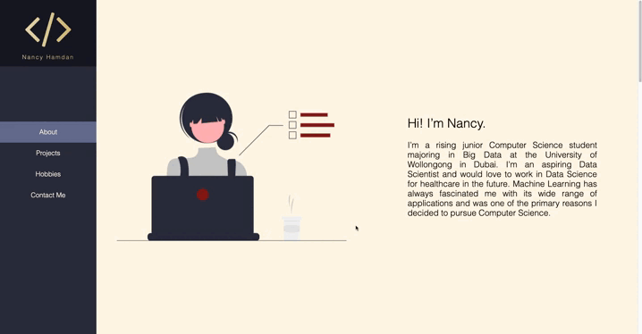
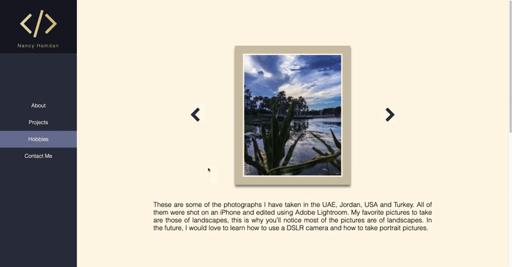
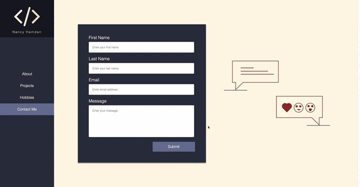

Personal website or ePortfolio. Developed as a university course requirement.

# Pages

1. [About](#about)
2. [Projects](#projects)
3. [Hobbies](#hobbies)
4. [Contact Me](#contactMe)

## About

## Projects

## Hobbies

## Contact Me

